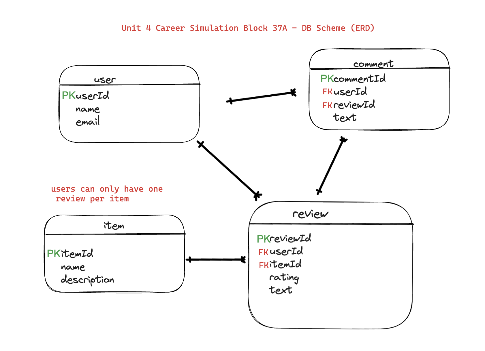

## Unit 4 Career Simulation - full backend devlopement project:

Overview
In this Career Simulation, Calliope asks you to create the back end of a review site for one of Fullstack Solutions' clients. After the back end has been completed, the client will review and provide feedback for improvement before starting the front end at a later time.

Instructions
In the email above, Calliope has requested that you build the back end first at the client's request. In order for you to have a full understanding of the full stack application, review the following requirements for each user experience:

AS A USER (NOT LOGGED IN), I SHOULD BE ABLE TO:

[x] Access the website via the Internet so I can browse and read reviews.
[ ] View details for a specific reviewed item (store, restaurant, product, book, etc.)

- I should be able to see the item’s average score or rating.
- I should be able to see any relevant information about the item.

[ ] Search for specific items(with a passed itemId), so I can see their scores and read reviews about them.
[x] Sign up for an account so I can have a logged-in experience.
[x] Log in to the site if I already have an account.

AS A LOGGED-IN USER, I SHOULD BE ABLE TO:

[ ] Write and submit a review for an item that includes:

- A written text review
- A score/rating
- Only one review should be allowed per item, per user

[ ] View a list of all reviews I have written.
[ ] Delete reviews I have written.
[ ] Edit reviews I have written.

- Change the text review.
- Modify the score/rating.

[ ] Write comments on reviews written by others.
[ ] View a list of all comments I have written.
[ ] Edit and delete my comments.

AS AN ENGINEER, I SHOULD:

[x] Have a well-seeded database so that I can simulate several different scenarios for the user stories below.

- - By doing this, you set yourselves up to tackle many of the points throughout the tiers. In the long run, this will potentially save you tons of time.
- - For example, seed hundreds of items and reviews with dummy data so that when you get to the “pagination” user story, you won’t have to worry about adding more.
- - Also, add a bunch of users with reviews so the review editing features can be worked on without already having the “write a review” functionality built.

[x] Have secured user data so that no one can unrightfully manipulate information.

---

Getting Started:

- Review each tab in this Simulation.
- Review the rubric at the bottom of this page.
- Be sure to create a schema and write tests before developing.

Requirements
For this project, develop the following:

- A project plan using GitHub Projects
- Database schema for the backend of a e-commerce application
- An API and functioning base routes with placeholder endpoints

Submission
When you are finished, submit a GitHub link containing:

- detailed planning tickets with task descriptions for each one
- an image or link to your complete database schema
- (testing API endpoints with POSTMAN will suffice)
- all relevant code for the project
- an updated repository with new commits

